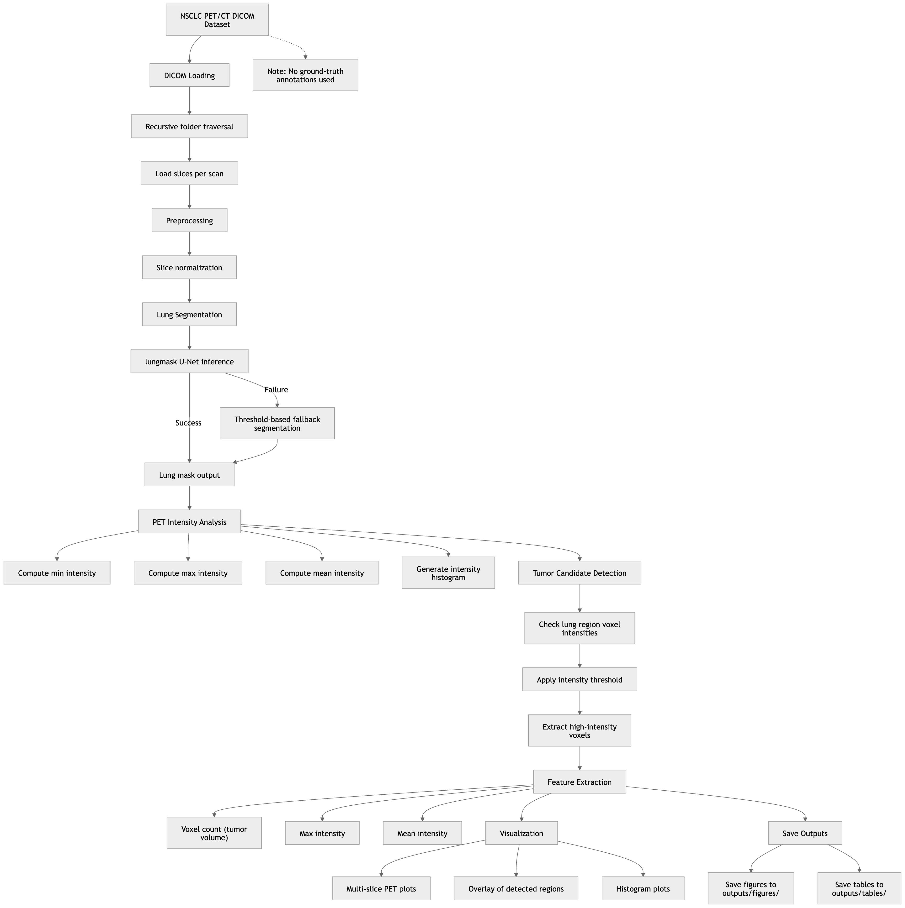
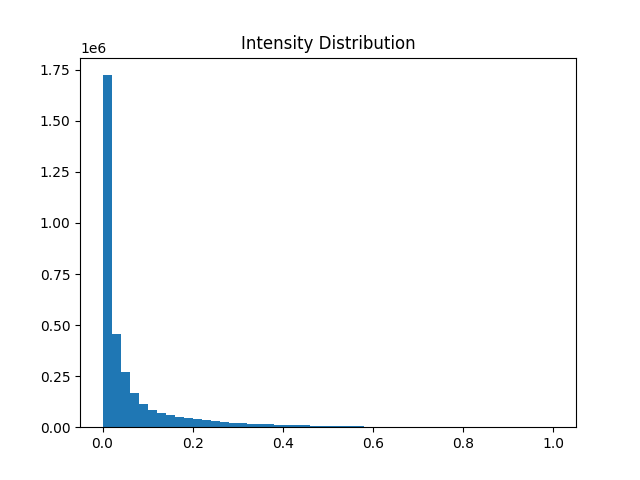
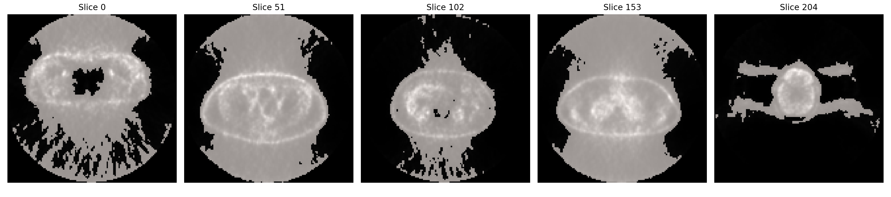
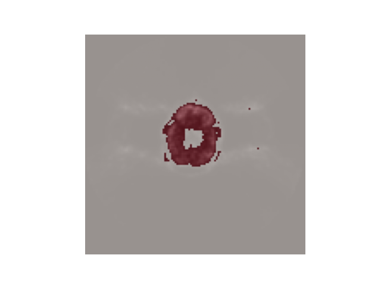

# PET/CT Tumor Segmentation and Quantitative Analysis for NSCLC

## Project Overview

This project presents a computational pipeline for **lung segmentation, tumor candidate detection, and quantitative PET analysis** using the NSCLC Radiogenomics dataset.

The objective is to simulate a real-world medical imaging workflow, focusing on:
- automated processing of DICOM data  
- robust segmentation under imperfect conditions  
- extraction of clinically relevant PET-derived metrics  

Due to the absence of ground-truth tumor annotations, the project is framed as:   
Radiomics analysis of automatically detected high-intensity tumor candidate regions
 

## Background

Lung cancer is one of the leading causes of cancer-related mortality worldwide, with **Non-Small Cell Lung Cancer (NSCLC)** accounting for approximately 85–90% of cases.

PET/CT imaging plays a key role in:
- tumor detection  
- staging  
- treatment planning  

Quantitative PET-derived measures such as:
- SUVmax
- SUVmean
- tumor volume

are widely used in clinical workflows.

Recent research shows that imaging-derived features can support **non-invasive tumor characterization**, particularly in radiomics-based pipelines.


## Methodology

### 1. Data Handling
- Recursive loading of DICOM files  
- Automatic identification of scan folders  
- Slice normalization  


### 2. Lung Segmentation

Two approaches were implemented:

#### Deep Learning (lungmask)
- Pre-trained U-Net model  
- Slice-wise inference  

#### Fallback Method
- Threshold-based segmentation  
- Automatically triggered if model fails  

Example:
⚠️ lungmask failed — using fallback segmentation


This ensures a robust and fully automated pipeline.


### 🆕 3. Intensity Analysis (Exploratory Step)

Before tumor detection, PET intensity distributions were analyzed to better understand the data:

- Minimum, maximum, and mean intensity values were computed  
- Histogram of voxel intensities was generated  

This step allows:
- identification of high-intensity regions  
- understanding variability across scans  
- data-driven selection of detection thresholds  

Example output:
```
Min:          0.0
Max:     84629.29
Mean:        0.41
```

Example histogram:   


### 4. Tumor Candidate Detection

- Adaptive thresholding based on PET intensity  
- Threshold computed within lung regions  
- Identifies **high-intensity regions as tumor candidates**

The threshold is derived from:
- lung-only voxel distribution (preferred)  
- global intensity distribution (fallback)  


Example:
```
Threshold:      0.39
```


### 5. Radiomics-Oriented Feature Extraction

Radiomics-style features were extracted from detected regions:

- Tumor candidate volume (voxel-based)  
- Maximum intensity (SUVmax proxy)  
- Mean intensity (SUVmean proxy)  

 **Important methodological note:**

Radiomics features were extracted from automatically detected high-intensity regions due to lack of ground-truth tumor annotations.


### 6. Visualization

The pipeline generates:

- Multi-slice PET visualizations  
- Tumor candidate overlays (red)  
- Intensity distribution histograms  

Visualizations serve both:
- qualitative validation of segmentation  
- interpretation of tumor candidate regions  

All outputs are automatically saved:
```
outputs/
├── figures/
└── tables/
```

## Results

Example output:
```
| Patient | Tumor_Volume_voxels | Max_Intensity | Mean_Intensity |
| ------- | ------------------- | ------------- | -------------- |
| R01-001 |       1363730       |      1.0      |    0.142992    |
```

### Observations

- Lung segmentation was robust due to fallback strategy  
- Tumor candidate detection is highly sensitive to threshold selection  
- Some scans produced:
  - no detected high-intensity regions  
  - zero-valued metrics  


### Interpretation

These results highlight key real-world challenges:

- variability in PET intensity across scans  
- lack of ground-truth tumor annotations  
- limitations of simple threshold-based detection  

Additionally:
- intensity distributions vary significantly between scans  
- threshold-based detection may over- or under-estimate tumor regions  

Zero-valued outputs do **not indicate failure**, but reflect:
- conservative detection strategy  
- dataset variability  
- absence of clear high-SUV regions in selected scans  


## Visualization

Example segmentation output:
 
   



## Limitations

- No ground-truth tumor labels available  
- Tumor detection based on intensity thresholding  
- lungmask model may fail on certain scans  
- Limited dataset size due to hardware constraints  

 Additional limitations:
- Intensity normalization may affect absolute SUV interpretation  
- Threshold-based detection is sensitive to noise and acquisition variability  


## Technical Stack

- Python  
- NumPy, Pandas  
- Matplotlib  
- PyDICOM  
- SimpleITK  
- lungmask (pre-trained U-Net)


## Project Structure
```
project/
├── notebook.ipynb
├── outputs/
│ ├── figures/
│ └── tables/
└── README.md
```


## Key Contributions

- Developed a robust PET/CT analysis pipeline  
- Implemented adaptive tumor candidate detection  
- Performed exploratory radiomics-style feature extraction  
- Generated automated visual and quantitative outputs   

 Additional contributions:
- Introduced data-driven threshold selection using intensity distributions 
- Integrated fallback segmentation for real-world robustness


## Future Work

- Integration of true radiomics (PyRadiomics)  
- Improved tumor segmentation methods  
- PET + CT multi-modal analysis  
- Machine learning-based classification  


## Important Note

This project does **not** perform clinical tumor segmentation.

Instead, it demonstrates:
- exploratory radiomics analysis  
- adaptive detection of high-intensity regions  
- robust handling of real-world medical imaging data  


## References

- TCIA NSCLC Radiogenomics Dataset  
- PET/CT imaging literature  
- lungmask segmentation model
