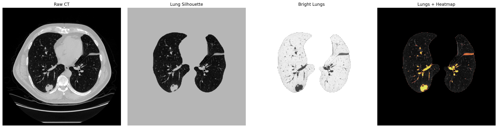
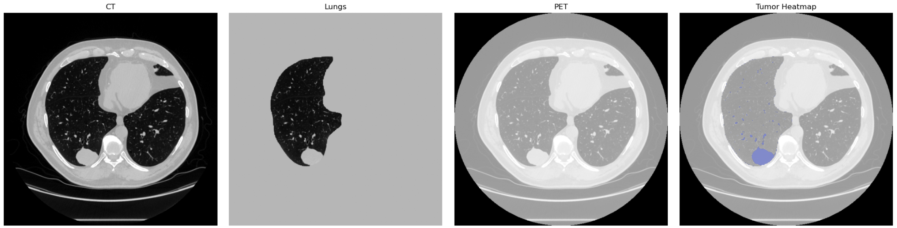

# PET/CT Image Analysis Pipeline for NSCLC Dataset

## Project Overview

This project implements an end-to-end **PET/CT image processing pipeline** in Python for exploratory analysis of the NSCLC Radiogenomics dataset.

The pipeline produces multi-panel visualization outputs combining CT, lung segmentation, and PET heatmaps for qualitative analysis (see Visualization section).

The pipeline integrates **anatomical (CT)** and **functional (PET)** imaging to enable:  
- automated processing of DICOM data  
- CT normalization to Hounsfield Units (HU) 
- robust lung segmentation under real-world conditions  
- detection of high-uptake regions in PET scans  
- extraction of quantitative intensity-based metrics  
- generation of visualization overlays for interpretation   

⚠️ This project is designed for **exploratory imaging analysis** and does not perform clinical tumor segmentation or diagnosis.

## Pipeline Overview

The figure below summarizes the full computational workflow:

 

## Background

Lung cancer is one of the leading causes of cancer-related mortality worldwide, with **Non-Small Cell Lung Cancer (NSCLC)** accounting for approximately 85–90% of cases.

PET/CT imaging plays a key role in:
- anatomical assessment (CT)  
- functional metabolic assessment (PET)  
- identification of regions with elevated tracer uptake  

Quantitative PET intensity analysis is widely used in:  
- radiomics research  
- exploratory imaging studie  
- imaging-based biomarker development  

## Methodology

### 1. Data Handling
- Recursive loading of DICOM files  
- Automatic filtering of CT and PET series  
- Handling of mixed and inconsistent scan structures  
- Shape consistency enforcement across slices   

### 2. CT Preprocessing & Normalization

- Conversion to **Hounsfield Units (HU)** using DICOM metadata  
- Intensity clipping to lung-relevant window (-1000 to 400 HU)  
- Standardized preprocessing for downstream analysis 

### 3. Lung Segmentation  
A robust, two-stage segmentation strategy is used:

#### Deep Learning (lungmask)
- Pre-trained U-Net model  
- Slice-wise inference on CT volumes  

#### Fallback Strategy
- Threshold-based segmentation when model confidence is low  
- Morphological operations (e.g., dilation) for stability  
- Largest connected component selection  

This ensures reliable lung extraction across heterogeneous scans.


### 4. PET Intensity Analysis

To address large variability in PET intensity ranges:

- Percentile-based clipping (1st–99th percentile)  
- Slice-wise normalization for visualization  
- Robust handling of extreme values and noise

### 5. Uptake-Based Region Detection

High-uptake regions are detected within lung areas using adaptive thresholding:

- Threshold computed from lung-only PET intensity distribution  
- Uses:
  - mean + 2×std (primary)
  - 95th percentile (fallback for low-variance scans)

This identifies **candidate regions of increased metabolic activity**.


### 6. Quantitative Feature Extraction

From detected regions, the following metrics are extracted:

- Region volume (voxel count)  
- Maximum PET intensity  
- Mean PET intensity  
- Relative tumor burden (voxel ratio)  

These features support **exploratory radiomics-style analysis**.. 


### 7. Visualization

The pipeline generates multi-panel visual outputs to illustrate key processing stages:

- CT slice (anatomical reference)  
- Lung segmentation (isolated lung region)  
- Enhanced lung visualization (contrast-adjusted)  
- PET intensity heatmap within lung regions  

These components are combined into a single subplot to provide an overview of intermediate processing steps and data transformation.

### Example Pipeline Visualization  
Example segmentation output:  
 

All generated outputs are automatically saved:
```
outputs/
├── figures/
└── tables/
```

## Results

### Example PET/CT Uptake Detection

The figure below presents the final output of the pipeline, combining anatomical (CT) and functional (PET) information.

- CT provides structural context  
- PET highlights metabolic activity  
- High-uptake regions are overlaid in blue for visual clarity  



### Example output:
```
| Patient | Tumor_Volume | Max_Intensity | Mean_Intensity |
| ------- | ------------ | ------------- | -------------- |
| R01-018 |   353,407    |     522.07    |      84.21     |
```

### Observations

- Lung segmentation is generally robust due to fallback mechanisms  
- PET intensity distributions vary significantly across scans  
- Uptake detection is sensitive to threshold selection  
- Some scans may not contain detectable high-uptake regions 


### Interpretation


The visualization demonstrates how regions of elevated PET signal are localized within anatomically segmented lung structures.

High-uptake regions are identified using adaptive thresholding applied to PET intensity values within the lung mask. These regions are visualized as color overlays (heatmaps), enabling direct comparison between functional activity (PET) and anatomical context (CT).

The detected regions represent **candidate areas of increased metabolic activity**, which may correspond to tumor-like patterns but are not clinically validated.

The extracted quantitative metrics (voxel-based volume, maximum intensity, and mean intensity) provide a **relative characterization of uptake patterns**, rather than absolute clinical measurements.

These results highlight common challenges in real-world medical imaging:

- variability in PET signal intensity across scans  
- lack of standardized intensity scaling (non-calibrated SUV)  
- absence of ground-truth annotations  
- sensitivity of threshold-based detection methods  

Therefore, detected regions should be interpreted as:

> **candidate high-uptake areas, not confirmed tumors**

Overall, the pipeline demonstrates how combined PET/CT analysis can support exploratory investigation of metabolic activity patterns in lung imaging data.

 
  


## Limitations  
- No ground-truth annotations available  
- Uptake detection is intensity-based (not supervised learning)  
- PET values are not fully standardized to clinical SUV  
- No explicit PET–CT spatial registration step  
- Sensitivity to acquisition variability and noise 

## Technical Stack

- Python  
- NumPy, Pandas  
- Matplotlib  
- PyDICOM  
- SciPy  
- lungmask (U-Net segmentation)


## Project Structure
```
project/
├── notebook.ipynb
├── outputs/
│ ├── figures/
│ └── tables/
└── README.md
```


## Key Contributions  
- Developed an end-to-end PET/CT DICOM processing pipeline  
- Implemented robust lung segmentation with fallback mechanisms  
- Designed adaptive PET intensity-based region detection  
- Built automated quantitative analysis and visualization workflow  
- Enabled reproducible exploratory analysis on real-world medical dat


## Future Work  
- True SUV computation using DICOM metadata  
- PET–CT spatial registration and resampling  
- Integration of PyRadiomics for advanced feature extraction  
- Machine learning models for lesion classification  
- Multi-patient batch processing and reporting  


## Important Note  
This project performs **exploratory PET/CT intensity-based analysis**.

It does not:  
- perform clinical tumor segmentation  
- provide diagnostic outputs  
- validate lesions against ground truth  

Instead, it demonstrates:  
- robust medical image pipelines  
- intensity-based region analysis  
- scalable DICOM handling and automation 


## References  
- TCIA NSCLC Radiogenomics Dataset  
- multimodal data integration (PET + CT)  
- quantitative and visual analysis of imaging data 
